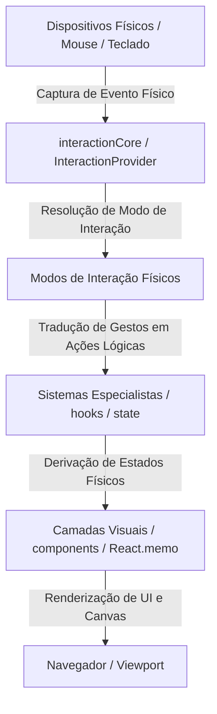

# Arquitetura Geral do Sistema (Roleplay System)

Este documento descreve o fluxo arquitetural e a divisão de responsabilidades adotada no projeto, consolidada nas fases de saneamento do código.

---

## 1. Filosofia Arquitetural

O projeto segue um modelo de fluxo de dados unidirecional e separação rígida de responsabilidades:

## 2. Separação de Camadas

O código está estruturado em três camadas fundamentais com fronteiras bem definidas:

### A. Núcleo (Core)
*   **Localização**: `src/core/`
*   **Função**: Contém a infraestrutura agnóstica de dados e eventos físicos. É o coração matemático e de capturas do sistema.
*   **Componentes Principais**:
    *   `spatial/`: Tipos estruturais e helpers puros de cálculo geométrico e conversões de tela/mundo.
    *   `interaction/`: Contexto de captura de eventos físicos, normalização de movimentos através de `requestAnimationFrame` (rAF) e guardas de cliques de HUD.

### B. Sistemas Narrativos e Atmosféricos (Systems)
*   **Localização**: `src/systems/`
*   **Função**: Detêm as regras de negócio de roleplay e o estado lógico do jogo.
*   **Componentes Principais**:
    *   `fog/`: Regras lógicas e checagem de revelação da Névoa de Guerra.
    *   `spatial/`: Estados de Holofote (spotlight) e alertas dinâmicos (pings).
    *   `environment/`: Estado do clima da cena (horror, exploração), vinhetas e áudios de ambiência.
    *   `narrative/`: Registro e seleção de cenários.

### C. Camada Visual de Exibição (Components)
*   **Localização**: `src/components/`
*   **Função**: Orquestrar a interface gráfica do usuário. Devem ser componentes puramente visuais e reativos.
*   **Design de Camadas (Battleground)**:
    O tabuleiro do jogo (`Battleground.tsx`) não renderiza tudo de forma monolítica. Ele compõe camadas visuais isoladas e memoizadas (`React.memo`) para evitar cascades de re-renderização:
    *   `MapLayer`: Desenho físico da imagem do mapa e grade tática.
    *   `FogLayer`: Máscaras SVG dinâmicas de revelação da névoa de guerra.
    *   `SpotlightLayer`: Efeito de iluminação e máscara radial de foco do holofote.
    *   `PingLayer`: Ondas expansivas e ripples de sinalização.
    *   `TokenLayer`: Renderizador individual memoizado (`TokenItem`) para movimentação de fichas.
    *   `EnvironmentLayer`: Vinheta multiplicativa (`mix-blend-multiply`) e sombras periféricas.
