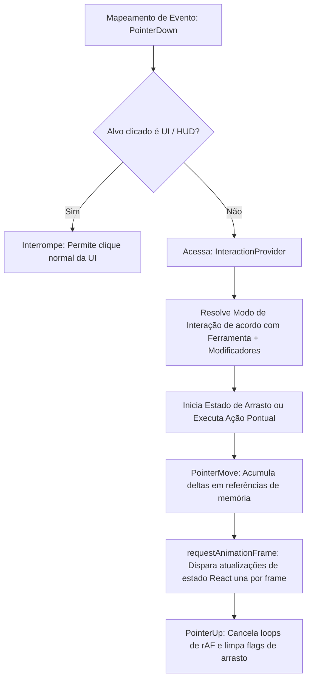

# Fluxo de Interações e Gestos (Interaction Flow)

O núcleo de interações captura eventos de ponteiro de baixo nível e os consolida em eventos de gestos semânticos e otimizados antes de entregá-los aos hooks de controle de estado.

---

## 1. Fluxo de Eventos Físicos

A captura e roteamento seguem um ciclo determinístico:



---

## 2. Otimização de Movimentos com requestAnimationFrame (rAF)

Atualizações contínuas de estado baseadas no evento `pointermove` (como arrastar um token ou câmera) ocorrem a taxas imprevisíveis e volumosas fornecidas pelo hardware do mouse. Se atualizarmos o estado do React diretamente para cada evento recebido, a tela sofrerá com gargalos de computação e pintura acumulada (layout reflow lag).

### Estratégia de Mitigação:
O `InteractionProvider` armazena as diferenças físicas acumuladas (`dx`, `dy`) e o cursor lógico em objetos de referência de memória pura (`useRef`). O despacho de eventos do React é restrito ao ciclo de animação física do hardware de exibição:

```typescript
// Acumula deltas no pointermove
pendingPan.dx += dx;
pendingPan.dy += dy;

// Agenda a atualização via rAF exatamente uma vez por refresh cycle
if (rafId === null) {
  rafId = requestAnimationFrame(() => {
    rafId = null;
    onPan(pendingPan.dx, pendingPan.dy);
    pendingPan = { dx: 0, dy: 0 };
  });
}
```

---

## 3. Modificadores e Teclas Especiais

*   **Barra de Espaço (Spacebar)**: Prevalece sobre qualquer outra ferramenta ativa do HUD, alternando temporariamente para o modo `'explore'` (pan de mapa).
*   **Tecla Alt**:
    *   No modo **Névoa de Guerra (FOW)**: Altera a ação do pincel de "Revelar" (`reveal`) para "Restaurar Névoa" (`restore`).
    *   No modo **Luz Focal (Spotlight)**: Ativa modificações no feixe de iluminação dinâmica.
*   **Botão Direito (Right-Click)**:
    *   No modo **Luz Focal (Spotlight)**: Dispara ações especiais de remoção ou customizações secundárias.
